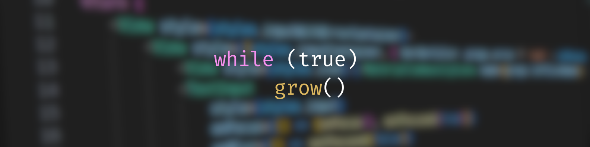

<!-- SUMMARY -->

# Hello world! I'm Facu :wave:

<!-- ABOUT ME -->
## About Me

I'm a 3rd year CS student, currently learning as much as I can about this amazing world of development.\
Feel free to check my repositories to learn more about what I've done, and don't forget suggestions are very welcome!

<!-- CONTACT -->
## Contact
[![GITHUB][personal-shield]][personal-url] [![LINKEDIN][linkedin-shield]][linkedin-url]

<!-- MARKDOWN LINKS AND IMAGES -->
<!-- MY GITHUB -->
[personal-shield]: https://img.shields.io/badge/FACUNDO-MU%C3%91OZ-yellowgreen?style=for-the-badge
[personal-url]: https://github.com/facundoMunoz
<!-- MY LINKEDIN -->
[linkedin-shield]: https://img.shields.io/badge/linkedin-%230077B5.svg?style=for-the-badge&logo=linkedin&logoColor=white
[linkedin-url]: https://www.linkedin.com/in/facundomunoz001/
